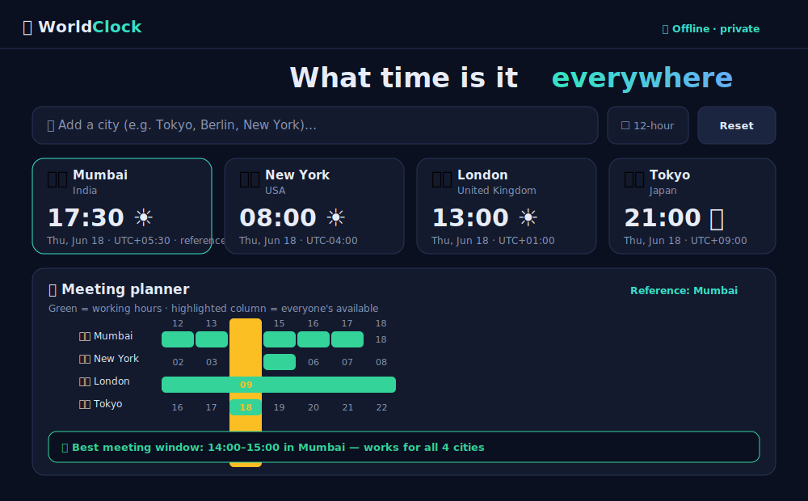

<div align="center">

# 🌍 WorldClock

### Time zones & meeting planner for a global world

See the current time across cities worldwide, then instantly find the **best overlapping hours
to meet** across time zones. Accurate (DST-aware via the browser's built-in timezone data),
private, and **100% in your browser**.

<p>
  
  
  
  
</p>

<a href="https://aashishbharti04.github.io/worldclock/"><b>🚀 Live demo</b></a> ·
<a href="docs/ARCHITECTURE.md">🏛️ Architecture</a> ·
<a href="CONTRIBUTING.md">🤝 Contributing</a>

</div>

---

## 📖 Project overview

Coordinating across time zones is one of the quiet daily frictions of remote and global work:
*"Is 3pm my time a reasonable hour for my teammate in Tokyo?"* **WorldClock** answers that at a
glance. Add the cities you care about to see live clocks, set everyone's working hours, and the
**meeting planner** highlights the windows when *everyone* is awake and working — no math, no
spreadsheets. It uses the browser's built-in **IANA timezone database** (via the `Intl` API), so
results are accurate and DST-aware with **zero external data and zero network calls**.

## 📸 Screenshot

<div align="center">
  
  <p><sub>Live clocks + the meeting planner finding the overlapping working window across cities (dark mode).</sub></p>
</div>

## ✨ Features

- 🕒 **Live world clocks** — add cities and watch their current time, date, day/night, and UTC offset update in real time
- 🗓️ **Meeting planner** — a 24-hour grid that highlights the hours when **all** your cities are within working hours
- 🟢 **Best meeting windows** — automatically lists the overlapping time ranges in your reference city
- 📌 **Pin any hour** to see the exact local time & date in every city at that instant
- ⭐ **Reference city** — set any city as the planner's anchor
- ⚙️ Adjustable **working hours**, **12/24-hour** format
- 🌍 ~65 major cities across every region, searchable by city or country (with flag emoji)
- 🌗 **Dark/light** mode; your cities & settings persist locally
- 🔒 **100% client-side** — accurate IANA/DST time math via `Intl`, no servers, no tracking, works offline
- 🧩 **Zero dependencies, zero build step**

## 🚀 Installation

Static site — no build, no install.

```bash
git clone https://github.com/aashishbharti04/worldclock
cd worldclock
python -m http.server 8000        # or: npx serve .
# open http://localhost:8000
```

Or just open the [live demo](https://aashishbharti04.github.io/worldclock/).

## 🕹️ Usage

1. **Search** for a city and click to add it (it seeds with your local zone + a few hubs).
2. Click **★** on a card to make it the planner's **reference** city.
3. Set everyone's **working hours**; the planner highlights columns where all cities overlap.
4. Read the **Best meeting windows** card, or **click a column** to pin a time and see it in every city.
5. Toggle **12-hour** format or **Reset to now** anytime.

## ⚙️ Configuration

No configuration or secrets. Your selected cities, reference, working hours, and format are
saved to `localStorage`.

## ☁️ Deployment

Auto-deploys to **GitHub Pages** via [`.github/workflows/pages.yml`](.github/workflows/pages.yml)
(Settings → Pages → Source: **GitHub Actions**). Fully static, so it also runs on Netlify,
Vercel, Cloudflare Pages, or any web server. See [docs/DEPLOYMENT.md](docs/DEPLOYMENT.md).

## 🗂️ Folder structure

```
worldclock/
├── index.html              # app shell (hero, search, clocks, planner)
├── assets/
│   ├── css/style.css       # design system, clocks grid, planner grid, responsive
│   └── js/
│       ├── cities.js       # curated city → IANA timezone dataset (+ flag emoji)
│       ├── tz.js           # timezone math via Intl (offsets, zoned parts, formatting)
│       └── app.js          # state, live clocks, planner overlap logic, search, theme
├── docs/                   # architecture, deployment, screenshot
└── .github/                # workflows + issue/PR templates
```

## ❓ FAQ

**How is the time accurate without a backend?** It uses `Intl.DateTimeFormat` with IANA time
zones — the same timezone database your OS/browser ships — so offsets and DST are correct.

**Does it track me or upload anything?** No. Everything runs locally; there are no network
calls except loading the UI web font.

**Why isn't my exact city listed?** The list covers major cities per zone. Any city in the same
IANA zone shows the same time — pick the nearest hub. PRs to add cities are welcome!

**Does it handle Daylight Saving Time?** Yes — DST transitions come from the browser's timezone
database automatically.

## 🤝 Contributing

PRs welcome — adding cities is a one-line change! See [CONTRIBUTING.md](CONTRIBUTING.md) and the
[Code of Conduct](CODE_OF_CONDUCT.md). Security reports: [SECURITY.md](SECURITY.md).

## 📄 License

[MIT](LICENSE) © Aashish Bharti — free for educational, learning, and community use.

---

<div align="center">

### 📬 Contact & Connect

**Email:** [aashish@marketdoctorsonline.com](mailto:aashish@marketdoctorsonline.com)

[LinkedIn](https://in.linkedin.com/in/aashana1012) ·
[GitHub](https://github.com/aashishbharti04) ·
[YouTube](https://www.youtube.com/@CodeWithAsur) ·
[Instagram](https://www.instagram.com/asurwave1012)

<sub>© WorldClock. All rights reserved. · This project is open source and available for
educational, learning, and community contributions.</sub>

</div>
